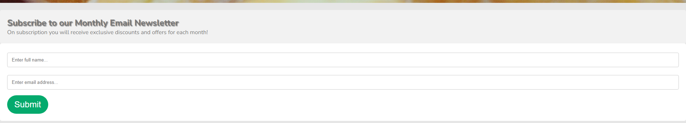

# UX

### Project goals

- This project has the main goal of informing customers of our new delivery service.
- It also has the goal of attracting new customers to the shop as well as trying to keep existing customers returning.
- This is to be done through a simple, easy to navigate website with all the information about the shops and products
  the owner has requested.

### Business goals

- The owner of Dans Doughnuts has stated what information he would like on the site. He is new to the online world and has
  requested that all shop locations with addresses and phone numbers are to be easy to find.
- He wants the delivery service to be advertised.
- He has also requested for the flavours to be put on.
- He has stated that he would like to reward customers if we can to give them a sense of value from returning to the shop and also
  advertise for extra business opportunities like festivals or private events to advertise brand name more.

### Customer goals

- After reaching out to a few customers its very clear to see they enjoy the product and quite regularly return. Despite being quite happy with the product and service they deserve to be able to access more value if possible.
- They also need to find out more about Dans Doughnuts as well as be able to quickly show friends the website.
- This should include finding locations, phone numbers, flavours and any deals for discount.

### Developer goals

- I am a fan of this product so I will devise a way to give more value to the customer as well as getting details from some of these customers so that Dans Doughnuts can advertise new discounts and deals to keep the customers coming back.
- I agree with the business owner that the website should be easy to navigate and easy to read as there is such a range of age of customers that
  it must be clear to a 10 yr old as well as a 88 yr old.

### User stories

As a customer of any age, I want:

- To be able to recognise I'm on the right website.
- To be able to clearly see how to navigate through the website.
- To have visible buttons to push to where I want to go.
- Feedback from the website when I'm navigating i.e. hovering over buttons.
- To be able to know all the flavours and see what they look like.
- To be able to know where the shops are.
- To know how to order and which telephone number to phone.
- To be able to benefit from discounts.

As a business owner, I want:

- To show customers where our shops are.
- A way to contact us.
- To display what we have to offer.
- To be able to gather customer information so that we can offer more value to them by email.
- Provide entertaining and interesting newsletter to keep us in the customers mind.
- Turn customers into returning customers.

### Design choices

- For my design choices I will try to capture the colours of the sprinkles on the doughnuts and use them within the website.
- There are lots of colours from the images of the doughnuts and I wanted to keep it that way as then they stand out more.
- For the background I have chosen an off white which will help the text colour to blend in with the rest of the website.
- The text color I will keep neutral as much as I can again just to emphasise the doughnut pictures.
- I will keep the website clean and not too cluttered as well as
  have similar theme and layout so away from the main page customers will find it easy to navigate with the natural order/flow of the website quite clear.
- I will do this by having a fixed clear navigation bar available as you scroll down to link to different pages.
- I will also make the form for the email newsletter to capture an audience to advertise to. This will be an uncluttered, easy to do form.

### Wireframes

- After creating the wireframes on my IDE I realised that something wasn't quite right. So I have made changes.
- I added an about section with reviews to split up my two main images on the home page.
- I took the flavour images out of the home page and created a new page just for this and added more flavours and images.
- I took out the contact page but left in the join page as I felt I was repeating myself having two similar pages with forms.

Here are the original wireframes:

---

## Features

### Existing features

Sign up form for an email newsletter.

Quick links to store locations and phone numbers.

Pictures of flavours available.

More flavours.

Links to social media.

Responsive website in all screen sizes.

---

## Technologies used

- For this website I have chosen to use HTML and CSS.
- AI has been used for the pictures through Canva.
- Font awesome was used for the icons.
- Codeanywhere was used as my IDE.

---

## Testing

- [W3C CSS Validation](https://jigsaw.w3.org/css-validator/)

- [W3C Markup Validation](https://validator.w3.org/)

I have used W3C CSS and Markup Validators to check the validity of my code.

### Testing Business Goals

As the owner of Dans Doughnuts, I want:

1. For the site to be clear and easy to understand.

   - Fixed nav bar allows users easy access to all information.
   - Name is clearly displayed.
   - Navigation paths seem logical and flowing.

2. For customers to know where we are and how to order.

   - locations can be accessed straight away from the main page.
   - Different flavours on offer are shown.
   - how to order is main call of action and is clear as well.

3. To be able to provide some value back to customers to get them to return.
   - This call to action is on the main page to target more returning customers getting value and discount.
   - With the monthly discounts and offers we put out we are confident people will return.
   - With the introduction of the telephone delivery we are confident this will attract new users and returning ones.

### Testing User Stories

As a customer of any age, I want:

1. To be able to recognise I'm on the right website.

   - Immediately on loading I can see the logo with the shops name very clear.

2. To be able to clearly see how to navigate through the website.

   - The navigation bar is prominent and can be seen.
   - Natural flow and order to site.
   - There are call to action buttons which will take you on the same navigational path.

3. To have visible buttons to push to where I want to go.

   - Yes all button are sized well enough to see and read.

4. Feedback from the website when I'm navigating i.e. hovering over buttons.

   - All links whether buttons, nav bar or logo will change when hovering the mouse pointer over.
   - The form has a customised thank you page as well.

5. To be able to know all the flavours and see what they look like.

   - The flavours page has been created and shows quite well what the flavours are and what each one looks like.

6. To be able to know where the shops are.

   - The locations page has been created and shows each shops location, city and postcode.
   - This can be accessed in one click from the main call to action button on the home page.

7. To know how to order and which telephone number to phone.

   - On the main page there is a call to action button which links to the locations page for the phone number.
   - Instructions say who can order and how in stand out text.

8. To be able to benefit from discounts.
   - On the main page further down we advertise this with a call to action button.

---

## Bugs

The first bugs I encountered was when I started to test my code. This is what they were and the solutions:

1. My hero-text was going out of position when the screen size reduced.
   - It took a while but I noticed I didn't include it in my `
` like my other images with text.
2. My navigation links were wrong on the locations page.
   - When I replaced the contact.html page with the flavours.html page I forgot to change it. It was spotted through testing.
3. It was highlighted that I could submit the form without typing in any text.
   - I had put in `required` but as my form was not active and the button was wrapped in an `<a>` anchor tag it was going straight through.
   - The solution was the `<form action="">` which in hindsight should of been the
     way I did it in the first place.
4. The contrast between text and background was highlighted on lighthouse report so I adjusted slightly to keep my design while allowing sufficient contrast.

## Deployment

This project was developed using the [Codeanywhere IDE](https://app.codeanywhere.com), commited to git and pushed to GitHub using the built in function within Codeanywhere.

To deploy this page to GitHub pages from its GitHub repository, the following steps were taken:

1. Log into **GitHub**.
2. From the list of repositories on the screen select **Seanl80/NewProject.1**.
3. From the menu items near the top of the page, select **Settings**.
4. Scroll down to **GitHub Pages** section.
5. Under **Source** click the drop down menu labelled **None** and select **Main Branch**.
6. On selecting Main Branch the page is automatically refreshed, the site is now deployed.
7. Scroll back down to **GitHub Pages** section to retrieve the link to the deployed website.

### How to run this project locally

To clone this project into Gitpod you will need:

1. A GitHub account. [Create a GitHub account here](https://www.github.com).
2. Use the Chrome browser.

Then follow these steps:

1. Install the Gitpod Browser Extensons for Chrome.
2. After installation restart the browser.
3. Log into Gitpod with your Gitpod account.
4. Navigate to the Project GitHub repository.
5. Click the green "Gitpod" button in the top right of the repository.
6. This will trigger a new gitpod workspace to be created from the code in github where you can work locally.

---

## Credits

### Code

These are the sources I used for my code.

- For the responsive nav bar links dropping into a drop down menu when the screen is shrunk I used this [YouTube video from CodingNepal](https://youtu.be/oLgtucwjVII?si=1y1oYOFR4jmPwpTe).
- For the sign up form I used code from [W3schools](https://www.w3schools.com/howto/howto_css_signup_form.asp) and customized it.
- For the hero image style I took inspiration from from the Love Running section from [CodeInstitute](https://codeinstitute.net). I also used Code Institute for the deployment section of this readme and the structure.

### Media

- For my images I used the AI on [Canva](https://www.canva.com/) to create them.
- For my check box and social media links I used [font awesome](https://fontawesome.com/).
- For my favicon image I used [favicon.ico Generator](https://www.favicon.cc/)
